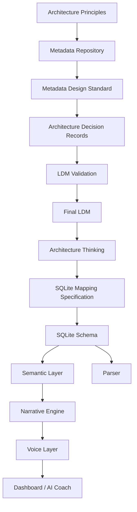

# Running Analytics Documentation

## Project Position

CoachOS is built Metadata-First.

Every data element is governed before it is implemented.

## Documentation Structure

```text
docs/
00_Governance/
    Principles

01_ADR/
    Architecture Decision Records

10_Canonical_Data_Model/
    Truth

20_Architecture/
    Thinking

30_Physical_Model/
    Implementation

40_Parser/
    Data Pipeline

50_AI/
    Intelligence

60_Excel/
    Excel Schema

```

## Architecture Knowledge Base

```text
Governance
    ↓
Decision Records
    ↓
Canonical Data Model
    ↓
Architecture
    ↓
Implementation
    ↓
Application
```

## Architecture Flow



## Reading Order

1. `Architecture Index.md`
2. `00_Governance/Architecture Principles.md`
3. `00_Governance/Product Design Principles v1.0.md`
4. `00_Governance/Journey Product Vision v0.1.md`
5. `00_Governance/Journey Experience Blueprint v0.1.md`
6. `00_Governance/Worldview Milestones.md`
7. `00_Governance/CoachOS Coach Knowledge Lineage v1.0.md`
8. `00_Governance/CoachOS Product Roadmap v1.0 Draft.md`
9. `00_Governance/Product UX Polish Sprint v1.0.md`
10. `00_Governance/CoachOS Chart Priorities v0.1.md`
11. `00_Governance/CoachOS Chart Requirements Specification v0.1.md`
12. `00_Governance/CoachOS Chart Semantic View and Data Field Mapping v0.1.md`
13. `00_Governance/CoachOS Activity Comparison Product Specification v1.0.md`
14. `00_Governance/CoachOS Comparison Intelligence Evolution Specification v1.0.md`
15. `20_Architecture/CoachOS Comparison Intelligence Design Review v0.1.md`
16. `20_Architecture/CoachOS Similar Activities Phase 1 Implementation Specification v1.0.md`
17. `20_Architecture/CoachOS Similar Activities Phase 1 Implementation Task Breakdown v1.0.md`
18. `20_Architecture/CoachOS Conditional Baseline Phase 2 Implementation Specification v1.0.md`
19. `30_Physical_Model/CoachOS Chart Semantic View SQL Draft v0.1.sql`
20. `30_Physical_Model/CoachOS Chart Semantic View SQL Notes v0.1.md`
21. `20_Architecture/CoachOS Chart Rendering Contract v0.1.md`
22. `20_Architecture/CoachOS Chart API Payload Examples v0.1.md`
23. `00_Governance/Running Analytics Metadata Repository v1.1.md`
24. `00_Governance/Metadata Design Standard v1.0.md`
25. `01_ADR/`
26. `00_Governance/Canonical Data Model Release Notes.md`
21. `10_Canonical_Data_Model/Activity LDM v1.1 Final.md`
22. `10_Canonical_Data_Model/LDM Validation Round 1 - activity.md`
23. `10_Canonical_Data_Model/Kilometer Split LDM v1.1 Final.md`
24. `10_Canonical_Data_Model/LDM Validation Round 1 - kilometer_split.md`
25. `10_Canonical_Data_Model/Shoe LDM v1.1 Final.md`
26. `10_Canonical_Data_Model/LDM Validation Round 1 - shoe.md`
27. `10_Canonical_Data_Model/Workout Type LDM v1.1 Final.md`
28. `10_Canonical_Data_Model/LDM Validation Round 1 - workout_type.md`
29. `10_Canonical_Data_Model/Training Purpose LDM v1.1 Final.md`
30. `10_Canonical_Data_Model/LDM Validation Round 1 - training_purpose.md`
31. `10_Canonical_Data_Model/Activity Training Purpose LDM v1.1 Final.md`
32. `10_Canonical_Data_Model/LDM Validation Round 1 - activity_training_purpose.md`
33. `20_Architecture/Narrative Engine Boundary Draft v0.1.md`
34. `20_Architecture/Narrative Engine Evolution v0.1.md`
35. `20_Architecture/Context Gap Log v0.1.md`
36. `20_Architecture/Recovery Knowledge Model v0.1.md`
37. `20_Architecture/Load Build Knowledge Domain v0.1.md`
38. `20_Architecture/Activity Coach Knowledge Implementation Note v0.1.md`
39. `20_Architecture/Monthly Reading Pattern v0.1.md`
40. `30_Physical_Model/SQLite Mapping Specification v1.0.md`
41. `30_Physical_Model/SQLite Schema v1.0.sql`
42. `30_Physical_Model/Semantic Layer v1.0.md`

## Governance Principle

The Metadata Repository is the single source of truth.

LDM, SQLite schema, parser output, Excel schema, dashboard, and AI Coach behavior should be validated against it.
